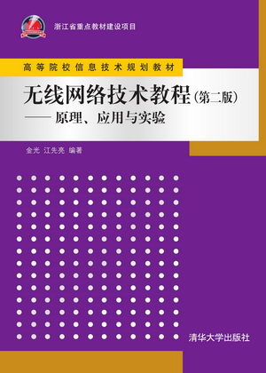
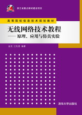
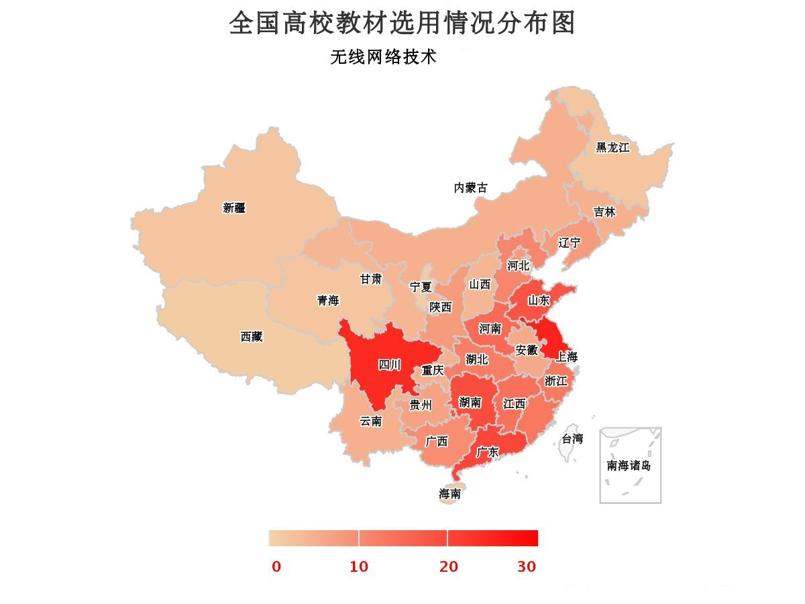

### 教材
----------------------

本书围绕各种主流无线网络技术，系统介绍相关原理、应用和实验。共12章，内容包括无线通信基础知识、无线局域网、无线城域网和蜂窝移动通信、卫星网络和空天信息网络、无线自组织网、无线传感网、无线个域网、物联网、车联网、无线体域网/室内定位/智能家居网、无线网络安全等。

				
第5版深入介绍WiFi6/WiFi7、5G详解、北斗导航、低轨卫星互联网、无人机通信、IEEE 802.15.4/ZigBee(传感网)、水声通信、6LoWPAN、CoAP、RPL、LoRaWAN/NB-IoT(低功耗广域物联网)、IEEE 802.11P(自组织车联网)、C-V2X(蜂窝车联网)、IEEE 802.15.6(体域网)、各种室内定位、物联网安全、蜂窝通信安全等技术，展望6G、自动驾驶汽车、量子安全通信等前沿。

				
本书内容新颖，覆盖全面，突出“理论+应用+实践”的特色，电子资源丰富。针对各种无线网络，先阐述原理，然后介绍应用实例，考虑到越来越多学校对实验实践环节的要求，提供了丰富的实验内容供师生选择使用。

				
可作为计算机/网络工程/通信/电子/自动化/物联网/信息安全/软件工程等专业的本科生/硕士生/在职研究生学习“无线网络技术”、“网络实践技术”等课程的教学用书，“计算机网络”等课程的补充内容和参考书，以及相关领域工程技术人员的参考书。

        
本书获评浙江省重点教材(2011)、浙江省优秀教材(2017)、浙江省新形态教材(2017)、浙江省重点教材(2022)。

        	

          		

            		
          		

        	

        	

          		

            		
          		

        	

        	

          		

            		
          		

        	

        	

<strong>在线购买</strong>: <a href="https://www.amazon.cn/%E9%AB%98%E7%AD%89%E9%99%A2%E6%A0%A1%E4%BF%A1%E6%81%AF%E6%8A%80%E6%9C%AF%E8%A7%84%E5%88%92%E6%95%99%E6%9D%90-%E6%97%A0%E7%BA%BF%E7%BD%91%E7%BB%9C%E6%8A%80%E6%9C%AF%E6%95%99%E7%A8%8B-%E5%8E%9F%E7%90%86%E5%BA%94%E7%94%A8%E4%B8%8E%E5%AE%9E%E9%AA%8C-%E9%87%91%E5%85%89/dp/B06XNMJNMQ/ref=sr_1_5?s=books&ie=UTF8&qid=1494313823&sr=1-5&keywords=%E6%97%A0%E7%BA%BF%E7%BD%91%E7%BB%9C%E6%8A%80%E6%9C%AF%E6%95%99%E7%A8%8B"><u>亚马逊</u></a>; <a href="http://product.dangdang.com/24216222.html"><u>当当网</u></a>; <a href="https://item.jd.com/12151164.html"><u>京东商城</u></a>; <a href="https://detail.tmall.com/item.htm?spm=a230r.1.14.35.PLW1OZ&id=547239830541&ns=1&abbucket=1"><u>天猫商城</u></a>;  

      	

### 选用高校
----------------------

             
             	

截止2019.5，已被200余所高校选为教学用书

按省份及学校首字母排序

安徽：安徽科技学院等；&nbsp;北京：北京师范大学等；&nbsp;重庆：重庆邮电大学等；&nbsp;福建：华侨大学等；&nbsp;甘肃：兰州城市学院等；&nbsp;广东：华南理工大学等；&nbsp;广西：广西大学等；&nbsp;贵州：贵州大学等；&nbsp;海南：三亚学院等；&nbsp;河北：河北师范大学等；&nbsp;河南：河南大学等；&nbsp;湖北：武汉大学等；&nbsp;湖南：国防科技大学等；&nbsp;吉林：东北师范大学等；&nbsp;江苏：江苏大学等；&nbsp;江西：南昌大学等；&nbsp;辽宁：辽宁工业大学等；&nbsp;内蒙古：内蒙古大学等；&nbsp;宁夏：宁夏理工学院等；&nbsp;青海：青海民族大学等；&nbsp;山东：中国石油大学（华东）等；&nbsp;山西：大同大学等；&nbsp;陕西：长安大学等；&nbsp;上海：上海师范大学等；&nbsp;四川：四川大学等；&nbsp;天津：南开大学等；&nbsp;西藏：西藏民族大学等；&nbsp;新疆：喀什大学等；&nbsp;云南：昆明理工大学等；&nbsp;浙江：浙江大学等

<a href="http://www.thinkmesh.net/wireless/resource/college_list.html"><u>点击查看完整名单</u></a>
